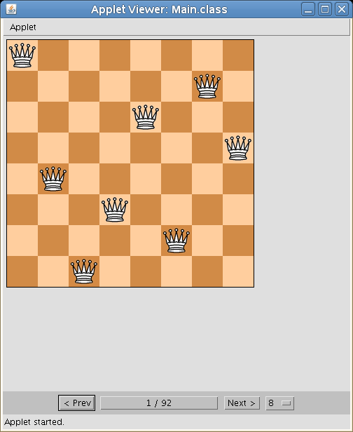

# The $N$-queens Problem Solver

[](https://github.com/megabyde/n-queens-solver/actions/workflows/main.yml)

## Overview

The $N$-queens problem asks:

> How can $N$ queens be placed on a $N \times N$ chessboard so that no two of them attack each other?

This Java applet provides a GUI to explore all possible solutions for the
$N$-queens problem for $N$ from 6 to 11.

The chess tile images are taken from [Wikimedia Commons](https://commons.wikimedia.org/wiki/Category:Standard_chess_tiles).



## Build the applet

```console
javac Main.java
```

## Start the application

```console
appletviewer application.html
```
